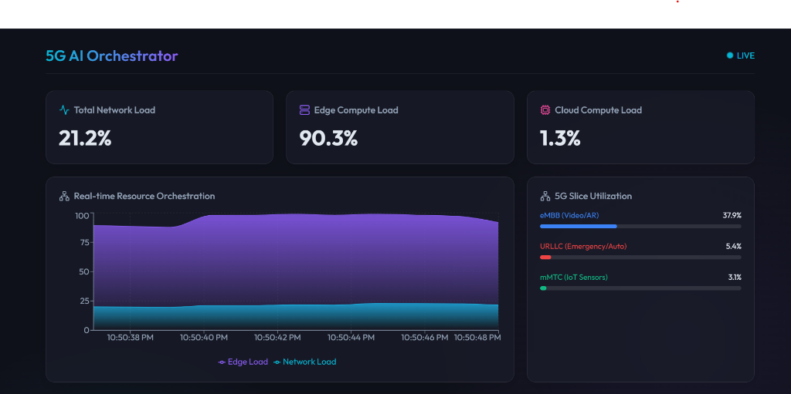
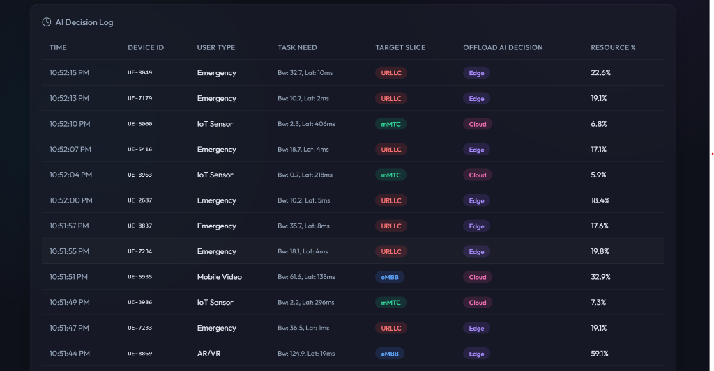
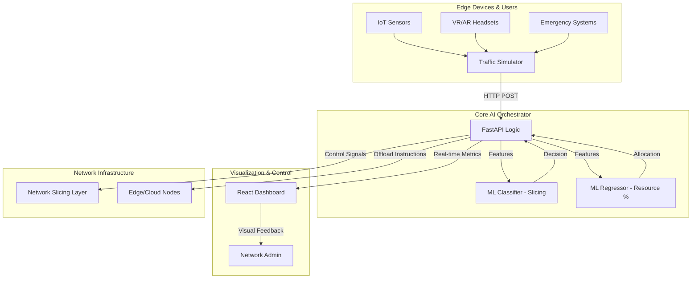

# 🌐 AI-Driven 5G Intelligent Resource & Edge Orchestration System

[](LICENSE)
[](https://www.python.org/)
[](https://reactjs.org/)
[](https://fastapi.tiangolo.com/)

> **🚀 Live Demo Dashboard**: [https://5-g-intelligent-resource-edge-orche.vercel.app/](https://5-g-intelligent-resource-edge-orche.vercel.app/)

An advanced, end-to-end orchestration framework designed to optimize 5G network resources through artificial intelligence. This system dynamically manages **Network Slicing** and **Edge Offloading** decisions in real-time, ensuring low latency for critical services and high throughput for data-intensive applications.

## ✨ Visual Showcase

<div align="center">
  
  <br />
  <p><i>The Live 5G AI Orchestrator Dashboard - Real-time resource metrics and telemetry</i></p>
  <br />
  
  <br />
  <p><i>Automated AI Decision Logs showing per-user task offloading and slice allocation</i></p>
</div>

## 🚀 Key Features

- **🧠 Intelligent Slicing Engine**: Automatically classifies traffic into **eMBB** (Enhanced Mobile Broadband), **URLLC** (Ultra-Reliable Low-Latency Communications), or **mMTC** (Massive Machine Type Communications) using Random Forest models.
- **⚡ Edge Computing Optimizer**: Real-time decision-making to offload tasks to the Edge or Cloud based on battery levels, task complexity, and latency requirements.
- **📊 Interactive Real-time Dashboard**: A high-performance React/Vite dashboard featuring live telemetry, resource utilization heatmaps, and AI decision logs.
- **🤖 Realistic Traffic Simulator**: Includes a multi-threaded simulator that mimics real-world 5G congestion scenarios and device behaviors.
- **📡 RESTful Microservices**: Clean separation of concerns with a FastAPI backend providing high-throughput inference endpoints.

---

## 🏗️ System Architecture



---

## 🛠️ Tech Stack

- **Frontend**: React 18, Vite, Recharts, Lucide-React, CSS Glassmorphism
- **Backend**: Python 3.9+, FastAPI, Pydantic, Uvicorn
- **AI/ML**: Scikit-Learn, Joblib, Pandas
- **Simulator**: Python (Requests, Time, Random)

---

## 📦 Installation & Setup

### 1. Prerequisites
- Python 3.9 or higher
- Node.js 18+ & npm

### 2. Backend Setup
```bash
cd backend
python -m venv venv
source venv/bin/activate  # On Windows: venv\Scripts\activate
pip install -r requirements.txt
python train_model.py     # Initialize AI models
python main.py             # Start API
```

### 3. Frontend Setup
```bash
cd frontend
npm install
npm run dev
```

### 4. Run Simulator
```bash
cd simulator
python simulate.py
```

---

## 📖 Usage Guide

1.  **Start the Backend**: Ensure the FastAPI server is running on `localhost:8000`.
2.  **Launch the Dashboard**: Access the UI at `localhost:5173`.
3.  **Simulate Traffic**: Run the simulator script to start generating real-time 5G requests.
4.  **Monitor AI Decisions**: Watch the "AI Decision Log" in the dashboard to see how the system handles different user types (e.g., giving high priority and URLLC slice to Emergency users).

---

## 🤝 Contributing

Contributions are what make the open-source community such an amazing place to learn, inspire, and create. Any contributions you make are **greatly appreciated**.

1. Fork the Project
2. Create your Feature Branch (`git checkout -b feature/AmazingFeature`)
3. Commit your Changes (`git commit -m 'Add some AmazingFeature'`)
4. Push to the Branch (`git push origin feature/AmazingFeature`)
5. Open a Pull Request

---

## 📄 License
Distributed under the MIT License. See `LICENSE` for more information.

---
**Maintained by [shivdev79](https://github.com/shivdev79)**
